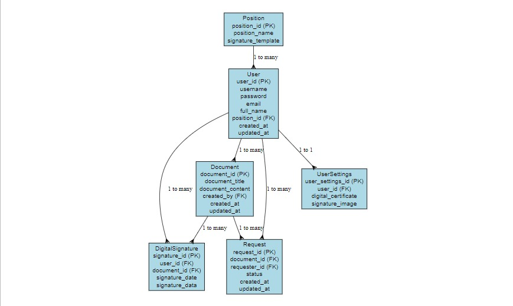

<h1 align="center">
  </h1>

<h1 align="center">Data Elevate Solution
   </h1>

  
Welcome to the Data Elevate Solution repository. This repository contains the codebase, documentation, and resources for our cutting-edge data analysis services. Our goal is to transform raw data into actionable insights, driving businesses toward greater success.

 </img>

  
## contents :

  
[Overview](Overview)
•
[Contributing](Contributing)
•
[Dashboard Database](Dashboard-Databasen)
•
[Demo](Demo)
•
[contributor](contributor)

 ## **Overview**

Data Elevate is a data consulting firm specializing in comprehensive data analysis services, offering customized solutions to meet the unique needs of each client. We collaborate with various types of businesses to help them leverage the power of data in strategic and operational decision-making. Our services include:

+ **Predictive Analytics** : Utilizing advanced statistical models to forecast future trends and identify growth opportunities.
+ **Data Visualization**: Creating clear and compelling visual representations of complex data to facilitate easy understanding and strategic planning.
+ **Business Intelligence**: Transforming raw data into meaningful insights to support effective decision-making processes.
+ **Mining**: Discovering hidden patterns and relationships within data sets to uncover valuable insights.
+ **Machine Learning**: Implementing state-of-the-art machine learning algorithms to automate processes and enhance predictive capabilities.

  
   
 
 

## Contributing
Transform your business data into a strategic asset with Data Elevate! Experience advanced, customized data analysis services tailored to your needs. Make data your greatest asset and drive business growth with our innovative solutions. Contact Data Elevate now and elevate your business to new heights!

## Dashboard Database

Berikut merupakan tampilan awal Dashboard Database

**DATA**

contoh data simulasi dashboard
| Name ID                   | Name                       | Position ID                | Position                   |
| --------------------------| -------------------------- | -------------------------- | -------------------------- |
| G01                       | Budi Santoso               |  A01                       | CEO                        |
| G02                       | Siti Aminah                |  A02                       | Manager                    |
| G03                       | Dewi Kartika               |  A03                       | Assistant Manager          |
| G04                       | Agus Wijaya                |  A04                       | Senior Engineer            |
| G05                       | Rina Sari                  |  A05                       | Junior Engineer            |

**ERD**
## :chart_with_downwards_trend: ERD

ERD (Entity Relationship Diagram) menampilkan hubungan antara entitas dengan atribut. Pada project ini. 

  

## Demo

Berikut merupakan link untuk shinnyapps atau dashboard dari project kami:

##  contributor
 
<b>Data Elevate Solution (dataelevatesolution@gmail.com)</b>
 
